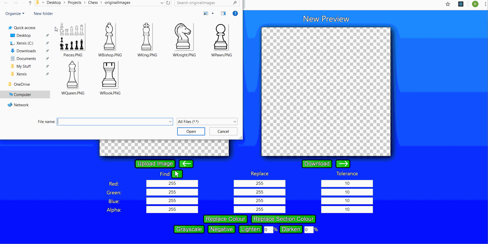
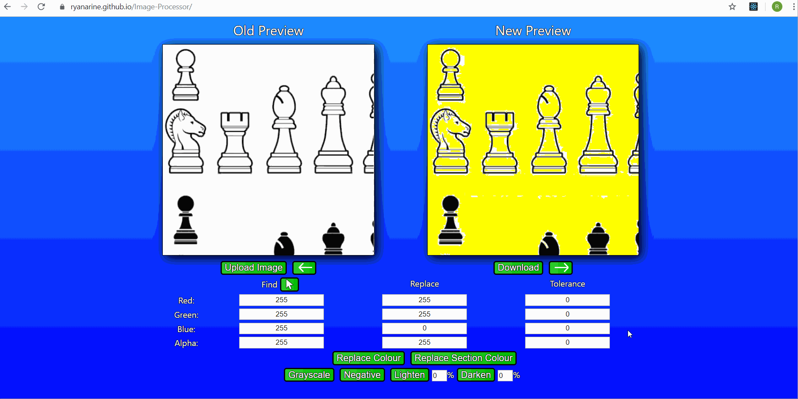
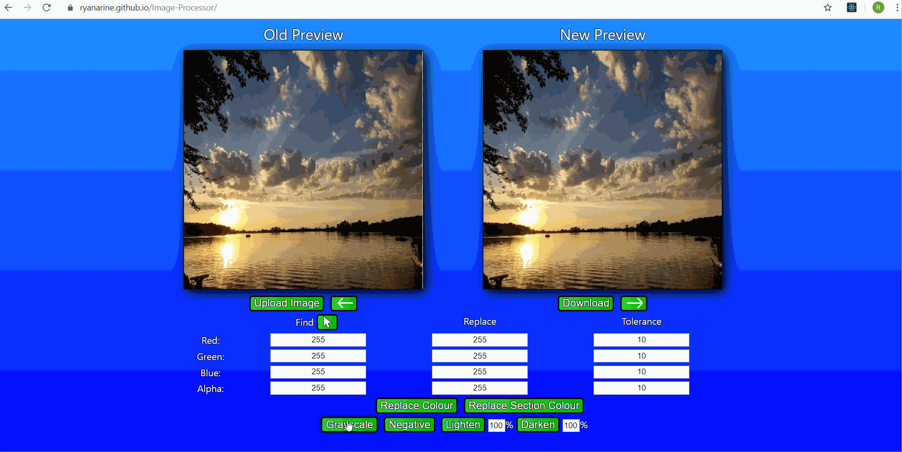

# Image-Processor
This application is an image processing tool that can change the pixel values of an image in many ways.  
You can view this application [here](https://ryanarine.github.io/Image-Processor/).

## Goals
This application is not finished so there are still some things I have yet to implement (this is a growing list):  
-Improved support for finding colour (Ex: Find pixels that have a red value that is >= 50% of its total brightness)  
-Improved support for replacing colour (Ex: Increase the blue value of pixels by the red value)
-Undo/Redo support  
-Two buttons that copy one canvas' coordinates and zoom level to the other  
-Colour Picker button

## Demos
Below are some demo GIFs showing off certain features (The background colours are deformed since GIFs only support 256 colours)

### Replacing Colour
In this GIF, I am replacing the pure white pixels in an image of Chess pieces with pure yellow pixels

### Replacing Colour with a Tolerance Range
Some white pixels were left over because they weren't pure white. I fix this by adding a tolerance range. Now any pixel with an RGBA value in the range (245-255, 245-255, 245-255, 245-255) will be replaced with a pure yellow pixel, leaving no white spots

### Replacing Colour within a Section
In this GIF, I want to make the white background transparent. I first replace all the white pixels with a transparent pixel (alpha value of 0), but this causes the white pieces to also be transparent. To fix this I use the replace section colour tool by first clicking on the background in the canvas. The application will then search the pixels surrounding the pixel I clicked on to identify what pixels belong to the section I selected. I then also select a section within the Queen piece to show this doesn't only work on the background.

### Adding and Subtracting Colour
This is a higher quality GIF so now you can see more colours. In this one, I want the tie to be blue instead of red. If I replace the red pixels with a blue pixel, the whole tie will be the same colour and look very unnatural. Instead of replacing colour, I subtract and add the red values and blue values by 100 to get a more natural look. 
  
Note that I have to do extra work to fix the leftover red pixels. It was hard to distinguish the red pixels from both the white and black pixels. I plan to add searching for percentages rather than pixels to solve this problem (Ex: Match any pixel where its red value is >=50% of its total brightness).  

Also note that some of the lighting information is lost (look at the difference at the bottom right of the tie). This is because some pixels on the tie have a red value lower than 100 and so the resulting pixel becomes brighter. I plan to fix this by adding the ability to add and subtract by the individual RGBA values (Ex: Set the red value to 0 and set the blue value to the original red value).
### Multiplying and Dividing Colour
In this GIF, I show off the multiplying and dividing colour functionality which allows me to "bluescale" the undershirt and tie of the previous image. I first set up the comparison operators and inputs to match any pixel with a red value of at least 25 (This matches part of the suit, so I use the section button). I set the blue replacement operator and input to multiply and 100% (doubling the blue value). 
  
Afterwards I divide and multiply the red and green value by 25% (divide and multiply by 1.25).
### Other Tools
In this GIF, I show off the Grayscale, Negative, Lighten and Darken tool. The latter two tools can be applied repeatedly.

