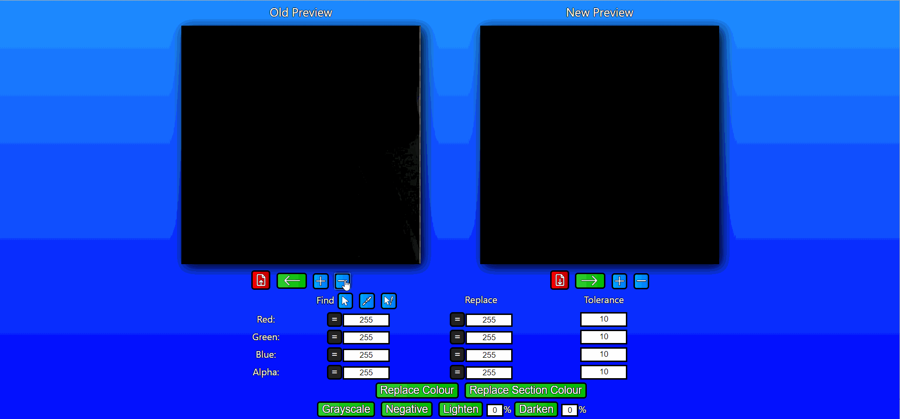

# Image-Processor
This application is an image processing tool that can change the contents of an image in many ways. You can view this application [here](https://ryanarine.github.io/Image-Processor/). Below are some demo GIFs displaying certain features.

### Replacing Colour
In this GIF, I am replacing the pure white pixels in an image of Chess pieces with pure yellow pixels

### Replacing Colour with a Tolerance Range
Some white pixels were left over because they weren't pure white. I fix this by adding a tolerance range. Now any pixel with an RGBA value in the range (245-255, 245-255, 245-255, 245-255) will be replaced with a pure yellow pixel, leaving no white spots

### Replacing Colour within a Section
In this GIF, I want to make the white background transparent. I first replace all the white pixels with a transparent pixel (alpha value of 0), but this causes the white pieces to also be transparent. To fix this I use the replace section colour tool by first clicking on the background in the canvas. The application will then search the pixels surrounding the pixel I clicked on to identify what pixels belong to the section I selected. I then also select a section within the Queen piece to show this doesn't only work on the background.

### Other Tools
In this GIF, I show off the Grayscale, Negative, Lighten and Darken tool. The latter two tools can be applied repeatedly.

